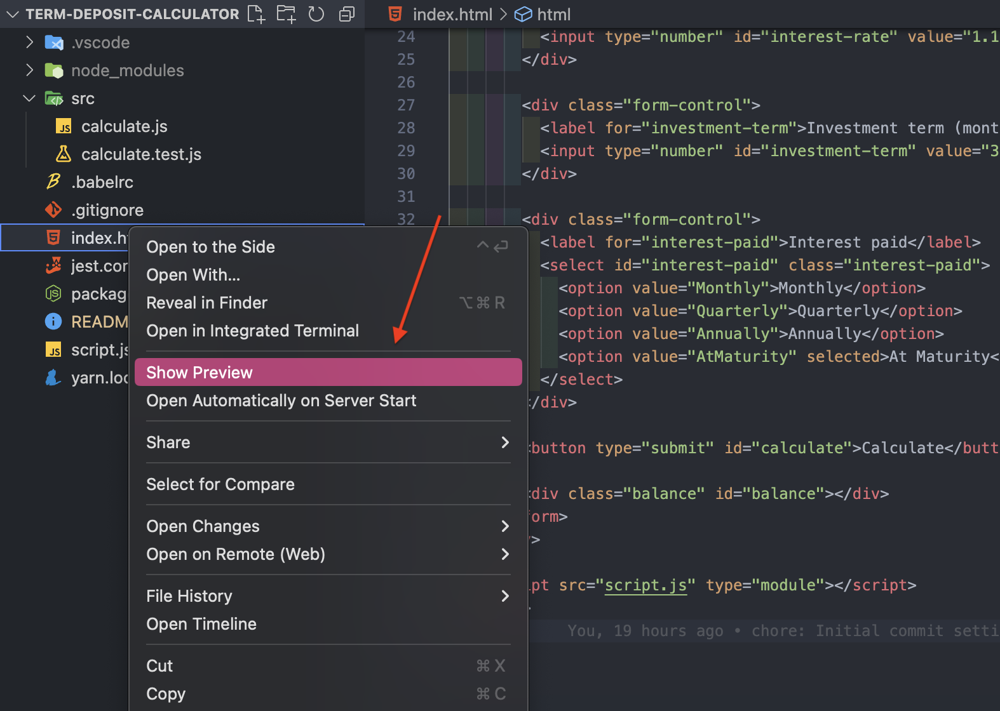

# term-deposit-calculator

A calculator that is used to forecast the return on a term deposit.

## About the project

This project has been created using Vanilla Javascript, HTML and CSS.

## Getting started

To get started with this project, follow these simple steps:

1. Clone this repository to your local machine
2. `npm install` in the root directory to install all dependencies.
3. If you're using Visual Studio Code, you can install the [Live Preview](https://marketplace.visualstudio.com/items?itemName=ms-vscode.live-server) extension which provides a local server for the static files.
4. After installing the extension, right-click on the `index.html` file in the root directory, and you'll see an option to `Show Preview` (see screenshot below). Clicking this option will launch a development server and open the HTML file.

## Running the tests

1. `npm test` to run all the unit tests available.
